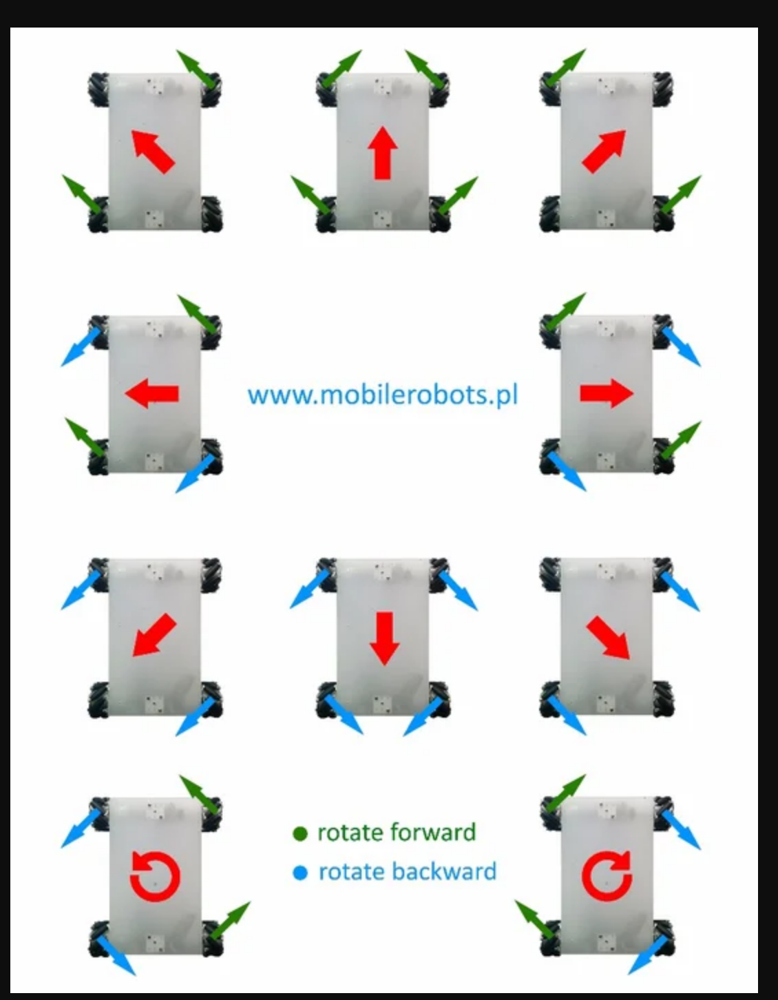

# CSE-321-Project3

## Introduction
In the practical world there are many situations when we need to use something
controlled by a computer to explore and capture a particular area. It would provide plenty of advantages 
if such an area is able to be navigated and mapped accurately using an autonomous 
navigation algorithm, mainly due to the extensive amount of consistent data it could provide.
We are seeing this in many applications of agile algorithm/human controlled robots like 
Boston Dynamic's robot dog SPOT. What we see is that the most effecient of these robots
are the ones that can flexibly move and sense the environment around them. One method of movement that
would be worth exploring is that of omnidirectional vehicles. That is what "PAC-BOT" aims to pursue. It would 
gradually create a map of the environment by exploring and measuring the distance between itself and another object 
in front of it.

Typical four wheel vehicles make a turn by rotating a pair of wheels on an axis, and moving forwarwd along the rotated 
direction vector, carrying the rest of the body with it. Although this is the most widely used 
approach in designing cars, or wheeled robots, it isnt the only method that exists in 
driving wheeled vehicles. Another method that exists are the driving of omnidirectional mecanum wheels. 
This allows for the vehicle immediately move in one direction or the other wiithout having to perform
turning mechanisms. The image below illustrates this concept.

## Implementation
This is what is hoped to be implemented with "PAC-BOT". A omni-directional, room mapping
robot that will ideally be able to map a room using sensor measurements.
PAC-BOT will be mostly autonomous when exploring a room (explore mode), there will also be an option to control
it through a keypad (obey mode). This latter will be the mode that is implemented first.
Also, Xplore may use a display to inform the user of any critical information. Currently that information
will be the distance of the nearest object, and the last direction that it was moving in. 
